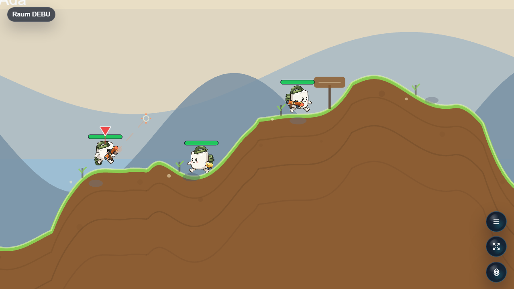

# Chaos-Kommando

Turn-based cartoon artillery game for Open Party Lab with mercenaries, wild weapons, and destructible terrain.



## Status

Alpha. The coastal artillery overhaul supports **2–6 teams, three commandos per team**.

- Three island arenas: Korallenriff, Brueckenbucht and Splitterinseln, with water channels, arches, caves and destructible ledges. Teams spawn interleaved across the arena.
- Original generated coastal background and sandstone texture; persistent team HP strips and a wider tactical camera.
- Distance-driven walking, fixed forward hop, higher backward salto, full-rig rotation, landing squash, aim tracking and weapon-specific recoil.
- Playable starting loadout across all weapon families. Pistols, shotgun and minigun fire direct shots; drill rockets excavate a 160-pixel tunnel before exploding. Heavy explosives excavate larger irregular craters. Smoke trails, sparks, dirt debris and damage numbers make outcomes visible.
- A turn has 2 seconds of preparation and 30 seconds of control. One attack starts a **3-second retreat immediately on release**. Afterwards controls lock while shots, falls, triggered mines and death sequences settle. Injury ends the active turn. Timeout and End Turn also wait for consequences.
- Phone controls start on the movement screen, with arsenal selection, hop/backflip, 1–5 second grenade fuses and End Turn. Rope is a movement utility; it cannot bypass a spent attack.
- Sudden death starts after at least 16 turns (24 for six teams) and raises the water. Ammo is finite and serializable; supply crates replenish it.

The character remains an original modular marshmallow rig, rather than copying Worms sprites. Existing torso, limb and carry assets are retained; the new environmental assets are documented in `public/host/chaos-kommando/environment/v2/ASSET-SOURCE.md`. Physical six-phone matches and final weapon/map balance still need playtesting.

Reference mechanics: [Team17 Armageddon controls](https://wa.worms2d.info/main.html?area=cont&page=abou), [Team17 W.M.D](https://www.team17.com/games/worms-w-m-d). Original game code and artwork; no third-party game assets.

Visual verification: a six-team match was inspected in the in-app browser at 1280×720; the phone controls were inspected at 390×844 with no scrolling needed. The concept's coastal palette, sandstone islands, open sky, compact navy HUD and six team strips are implemented. Terrain contours and destruction remain procedural so the visible holes match collision; existing modular character artwork is retained and animated anew. The backflip input was exercised live. The 15 rule tests also cover grenade retreat timing, falls, spent-turn restrictions, drill excavation, gun impacts and 18-unit spawning across all three maps and 30 seeds. A full platform typecheck/build passed. This is not a physical-device or complete weapon-balance certification.

## Run Through Open Party Lab

This repo is not a standalone app. Run it through the Open Party Lab platform.

Recommended layout:

```text
Open-Party-Lab/
  local-games/
    chaos-kommando/
```

From the Platform repo:

```bash
npm install
npm run games:sync-local
npm run dev:all
```

The Platform loads this game only when the repo exists locally and `npm run games:sync-local` links it. Missing optional games are skipped.

## GitHub Metadata

Description:

```text
Turn-based cartoon artillery game for Open Party Lab with mercenaries, wild weapons, and destructible terrain.
```

Suggested topics:

```text
open-party-lab party-game browser-game phaser typescript local-multiplayer artillery-game
```

## Package Entrypoints

- `@open-party-lab/game-chaos-kommando/manifest`
- `@open-party-lab/game-chaos-kommando/protocol`
- `@open-party-lab/game-chaos-kommando/server`
- `@open-party-lab/game-chaos-kommando/host`
- `@open-party-lab/game-chaos-kommando/controller`

The Platform should import only these public entrypoints.

## Development Checks

```bash
npm install
npm run typecheck
npm run test
npm run build
npm run pack:dry-run
```

For visual checks, start Open Party Lab, add virtual controllers when needed, and capture host screenshots through a browser.

## License

Code is licensed under the Apache License 2.0. See [LICENSE](LICENSE).

Assets, generated media, word lists, prompts, and third-party references may need separate rights review before public store distribution.
